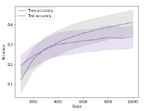
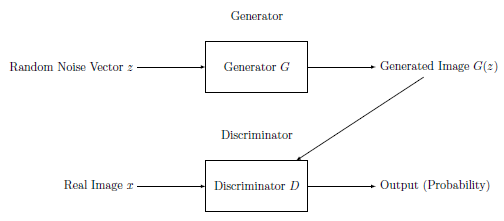
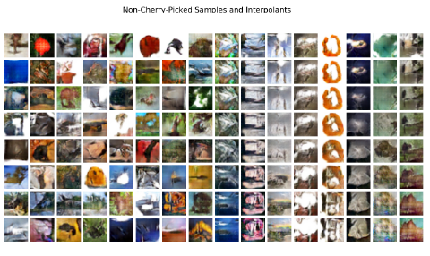

# Deep-Learning-Classification-and-Generative-Model

This project focuses on two key aspects of deep learning: image classification using Convolutional Neural Networks (CNN) and image generation using Generative Adversarial Networks (GANs). The project specifically explores the CIFAR-100 dataset for both tasks.

## Project Overview

### Part 1: Classification

#### Methodology
- **Approach:** The classification task is performed using a deep Convolutional Neural Network (CNN) with a non-linear activation function ReLU $`φ(x) = max(0, x)`$.
- **Dataset:** CIFAR-100 dataset.
- **Model Details:** The network uses hierarchical feature learning, translation invariance, parameter sharing, and pooling layers. The specific model implementation is inspired by the "SmallFiltersCNN" approach, which is a streamlined version suited for environments where a lighter model with fewer parameters is desired.
- **Mathematical Formulation:**

Let $`X`$ be the input tensor of shape $`[N, C_{in}, H_{in}, W_{in}]`$, where:
- $`N`$ is the batch size,
- $`C_{in}`$ is the number of input channels,
- $`H_{in}`$ is the height of the input feature map,
- $`W_{in}`$ is the width of the input feature map.

Let $`F^{(1)}, F^{(2)}, \dots, F^{(L)}`$ be the learnable convolutional filters of the CNN, where $`L`$ is the number of convolutional layers in the network.

The forward pass equations for a CNN can be expressed as follows:

<div align="center">

$`
Z^{(1)} = \text{Conv2d}(X, F^{(1)}) + b^{(1)}
`$

$`
A^{(1)} = \text{Activation}(Z^{(1)})
`$

$`
P^{(1)} = \text{Pooling}(A^{(1)})
`$

$`
\vdots
`$

$`
Z^{(L)} = \text{Conv2d}(P^{(L-1)}, F^{(L)}) + b^{(L)}
`$

$`
A^{(L)} = \text{Activation}(Z^{(L)})
`$

$`
P^{(L)} = \text{Pooling}(A^{(L)})
`$

$`
F = \text{Flatten}(P^{(L)})
`$

$`
Z_{fc} = W_{fc} \cdot F + b_{fc}
`$

$`
\hat{Y} = \text{Softmax}(Z_{fc})
`$

</div>

Where:
- $`Z^{(i)}`$ represents the linear output of convolutional layer $`i`$,
- $`A^{(i)}`$ represents the activation of convolutional layer $`i`$,
- $`P^{(i)}`$ represents the output after pooling at convolutional layer $`i`$,
- $`F`$ is the flattened feature map,
- $`Z_{fc}`$ represents the linear output of the fully connected layer(s),
- $`\hat{Y}`$ is the predicted class probabilities,
- Activation denotes the activation function used in the convolutional layers, typically ReLU, and
- Pooling denotes the pooling operation used after each convolutional layer, typically max pooling or average pooling.

The convolutional operation can be expressed as:

$`
O = \sigma(I * K + b)
`$

Where:
- $`I`$ represents the input feature map,
- $`K`$ is the kernel (or filter) applied to the input feature map,
- $`\sigma`$ denotes the ReLU activation function applied element-wise,
- $`b`$ is the bias term added to each output feature map.

#### Results
- **Parameters:** The network has 57,332 parameters.
- **Performance:**
  - Training Accuracy: 41.2%
  - Testing Accuracy: 33.9%
  - Optimization Steps: 10,000
  - Training Loss: 2.338

  </br>
- **Conclusion:** The results indicate moderate success in classifying the CIFAR-100 dataset. Further tuning and exploration of different architectures or activation functions could potentially improve performance.

#### Limitations
- **Future Improvements:**
  - Use of advanced activation functions like Leaky ReLU or Swish.
  - Incorporation of complex architectures such as residual connections or attention mechanisms.
  - Exploration of data augmentation techniques to enrich the training dataset.

### Part 2: Generative Model

#### Methodology
- **Approach:** A Generative Adversarial Network (GAN) is utilized, specifically a Deep Convolutional GAN (DCGAN), to generate images.
- **Architecture:**
  - **Generator (G):** Transforms random noise vectors $`z`$ into synthetic images $`G(z)`$.
  - **Discriminator (D):** Distinguishes between real images $`x`$ and fake images $`G(z)`$.
  - **Objective:** The model is trained using a binary cross-entropy loss function to minimize the difference between real and generated images.

The training objective for the GAN is:

$`
L_{GAN} = \mathbb{E}_{x \sim p_{data}(x)}[\log D(x)] + \mathbb{E}_{z \sim p_z(z)}[\log(1 - D(G(z)))]
`$

This adversarial game encourages the generator $`G`$ to produce increasingly realistic images, while the discriminator $`D`$ learns to better discriminate between real and fake images.

  </br>

#### Results
- **Parameters:**
  - Generator: 370,624 parameters
  - Discriminator: 167,808 parameters
  - Total: 538,432 parameters
  
  </br>
- **Performance:**
  - FID (Fréchet Inception Distance) Score: 66.49
  - Optimization Steps: 50,000
  - The generated images are fairly realistic, though still challenging to distinguish clearly.
- **Conclusion:** The model shows significant improvement during training, suggesting progress in generating images closer to the distribution of real images.

#### Limitations
- **Future Improvements:**
  - Explore alternative generative models or architectures for lower FID scores.
  - Implement techniques like minibatch discrimination to mitigate mode collapse.
  - Use data augmentation to increase the diversity and generalization capability of the model.

## Running the Models

To run the classification and generative models, follow these steps:

1. **Install Required Libraries:** Ensure you have the necessary Python libraries installed, including TensorFlow or PyTorch, depending on the implementation used.
   ```bash
   pip install tensorflow
2. **Run the Classification Model:**
   ```bash
   python classification_model.py
1. **Run the Generative Model:**
   ```bash
   python generative_model.py